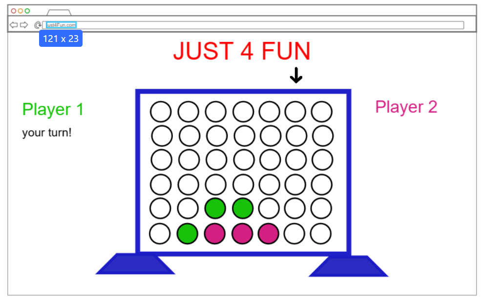

# Just4Fun

[My Notes](notes.md)

This application will be an online version of the classic game Connect Four. It will allow users to login and play their friends. This README will be an overview of various technologies used in the game as well as a few possible uses.

## 🚀 Specification Deliverable

For this deliverable I did the following. I checked the box `[x]` and added a description for things I completed.

- [x] Proper use of Markdown
- [x] A concise and compelling elevator pitch
- [x] Description of key features
- [x] Description of how you will use each technology
- [x] One or more rough sketches of your application. Images must be embedded in this file using Markdown image references.

### Elevator pitch

Remember when you were a kid and played Connect Four with your siblings or friends? So fun right? Now remember how frustrated you were when the game broke, letting all the pieces fall before you were finished. Or how annoying it was when your little sister threw the game across the room because you beat her (again)? The Just4Fun application removes all these and other obstacles, allowing you and your friends to play a new version of Connect Four without the drama! After logging in, you can play game after game with your friends, even saving games you don't have time to finish, allowing you to come back later. Just4Fun is all the nostalgia and none of the nuisance!

### Design

### Key features

- Users will be able to choose their chip color
- Players choose where to play their next piece by moving a sliding arrow across the top
- Two players can play each other in a game. Their moves will be broadcast to each other

### Technologies

I am going to use the required technologies in the following ways.

- **HTML** - Basic structure of my website. I'll use HTML to create the base of my login page and the page where users play the game.
- **CSS** - I'll use CSS to add colors to the page so players know whose piece is whose. CSS will help me style the pages I created using HTML so they're more user-friendly.
- **React** - I will use React to let the user interact with the board. This technology will allow players to click where they want their pieces to go.
- **Service** - Provides endpoints for:
  - register, login, logout
  - accessing unfinished games
  - creating a new game
  - playing a piece in the game
  - checking if someone has won the game
  - calling http://numbersapi.com/ to display random facts about the number 4 and its multiples
- **DB/Login** - Store authentication information of users as well as their unfinished games.
- **WebSocket** - communicates back and forth to the two users playing the game what the other user did in their last turn.

## 🚀 AWS deliverable

For this deliverable I did the following. I checked the box `[x]` and added a description for things I completed.

- [X] **Server deployed and accessible with custom domain name** - [My server link](https://just4fungame.click).

## 🚀 HTML deliverable

For this deliverable I did the following. I checked the box `[x]` and added a description for things I completed.

- [X] **HTML pages** - I added three HTML pages. A home page, a page to play the game, and a page to look at previous games.
- [X] **Proper HTML element usage** - I added headers, footers, navigation sections, and a few lists on these pages.
- [X] **Links** - I have links on each page that links to each of the other pages. I also added a link on the bottom of each page to my github repo.
- [X] **Text** - I added text about the game and headers on each page.
- [X] **3rd party API placeholder** - I added a placeholder for the random number fact on my gameplay page.
- [X] **Images** - I added an image of connect four to the website.
- [X] **Login placeholder** - I added a login placeholder on the home page.
- [X] **DB data placeholder** - I added a placeholder for the list of games that will be stored in the database.
- [X] **WebSocket placeholder** - I put a placeholder in for updating the board when the other person makes a move.

## 🚀 CSS deliverable

For this deliverable I did the following. I checked the box `[x]` and added a description for things I completed.

- [ ] **Header, footer, and main content body** - I did not complete this part of the deliverable.
- [ ] **Navigation elements** - I did not complete this part of the deliverable.
- [ ] **Responsive to window resizing** - I did not complete this part of the deliverable.
- [ ] **Application elements** - I did not complete this part of the deliverable.
- [ ] **Application text content** - I did not complete this part of the deliverable.
- [ ] **Application images** - I did not complete this part of the deliverable.

## 🚀 React part 1: Routing deliverable

For this deliverable I did the following. I checked the box `[x]` and added a description for things I completed.

- [ ] **Bundled using Vite** - I did not complete this part of the deliverable.
- [ ] **Components** - I did not complete this part of the deliverable.
- [ ] **Router** - I did not complete this part of the deliverable.

## 🚀 React part 2: Reactivity deliverable

For this deliverable I did the following. I checked the box `[x]` and added a description for things I completed.

- [ ] **All functionality implemented or mocked out** - I did not complete this part of the deliverable.
- [ ] **Hooks** - I did not complete this part of the deliverable.

## 🚀 Service deliverable

For this deliverable I did the following. I checked the box `[x]` and added a description for things I completed.

- [ ] **Node.js/Express HTTP service** - I did not complete this part of the deliverable.
- [ ] **Static middleware for frontend** - I did not complete this part of the deliverable.
- [ ] **Calls to third party endpoints** - I did not complete this part of the deliverable.
- [ ] **Backend service endpoints** - I did not complete this part of the deliverable.
- [ ] **Frontend calls service endpoints** - I did not complete this part of the deliverable.
- [ ] **Supports registration, login, logout, and restricted endpoint** - I did not complete this part of the deliverable.

## 🚀 DB deliverable

For this deliverable I did the following. I checked the box `[x]` and added a description for things I completed.

- [ ] **Stores data in MongoDB** - I did not complete this part of the deliverable.
- [ ] **Stores credentials in MongoDB** - I did not complete this part of the deliverable.

## 🚀 WebSocket deliverable

For this deliverable I did the following. I checked the box `[x]` and added a description for things I completed.

- [ ] **Backend listens for WebSocket connection** - I did not complete this part of the deliverable.
- [ ] **Frontend makes WebSocket connection** - I did not complete this part of the deliverable.
- [ ] **Data sent over WebSocket connection** - I did not complete this part of the deliverable.
- [ ] **WebSocket data displayed** - I did not complete this part of the deliverable.
- [ ] **Application is fully functional** - I did not complete this part of the deliverable.
